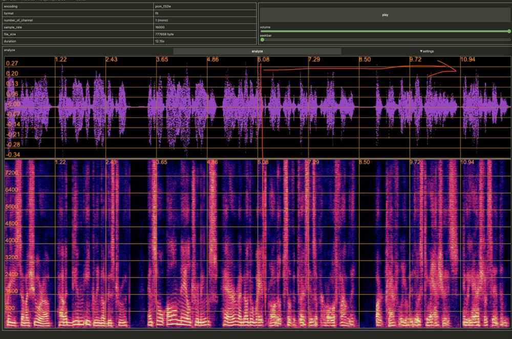

# Voicebox: Text-Guided Multilingual Universal Speech Generation at Scale
* [Official Introduction](https://voicebox.metademolab.com/)

# Progress
- [x] Wrote the training code on August 3rd
- [x] Wrote the inference code on August 4th
- [ ] Demo Page

## Results
* **The model is trained on LibriTTS (500 hours) on a single RTX 4090.**
* **The first half is used as Prompt, the second half is the synthesized audio. The audio clip is not used in training.**
	* use GroundTruth durations 

* **The Ground Truth**

